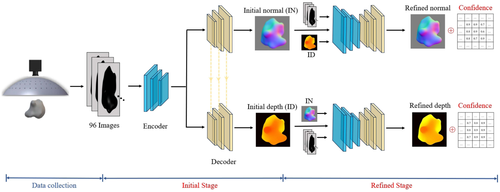

# Confidence-Aware PS
This repository provides the code implementation for our paper titled:

Confidence-aware photometric stereo networks enabling end-to-end normal and depth estimation for smart metrology


## Dependencies
- Python 3.7 
- PyTorch
- Torchvision
- PIL
- Numpy
- Scipy
- CUDA
- OpenCV

## Training
Once our synthetic dataset (TBU) is downloaded, the model can be trained by running the following commands for the initial and refinement stages, respectively:
```bash
python train_initial.py
```
```bash
python train_refine_nl.py
```

## BibTeX
```
@article{zhang2024confidence,
  title={Confidence-aware photometric stereo networks enabling end-to-end normal and depth estimation for smart metrology},
  author={Zhang, Yahui and Yang, Ru and Guo, Ping},
  journal={IEEE/ASME Transactions on Mechatronics},
  year={2024},
  publisher={IEEE}
}
```
